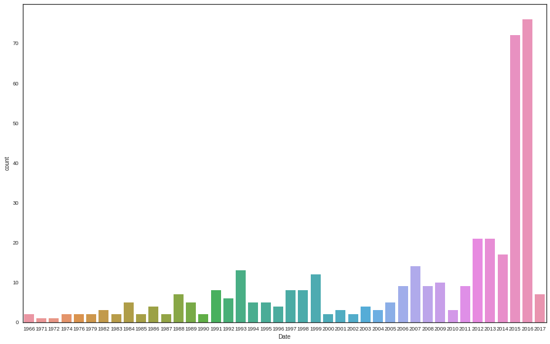
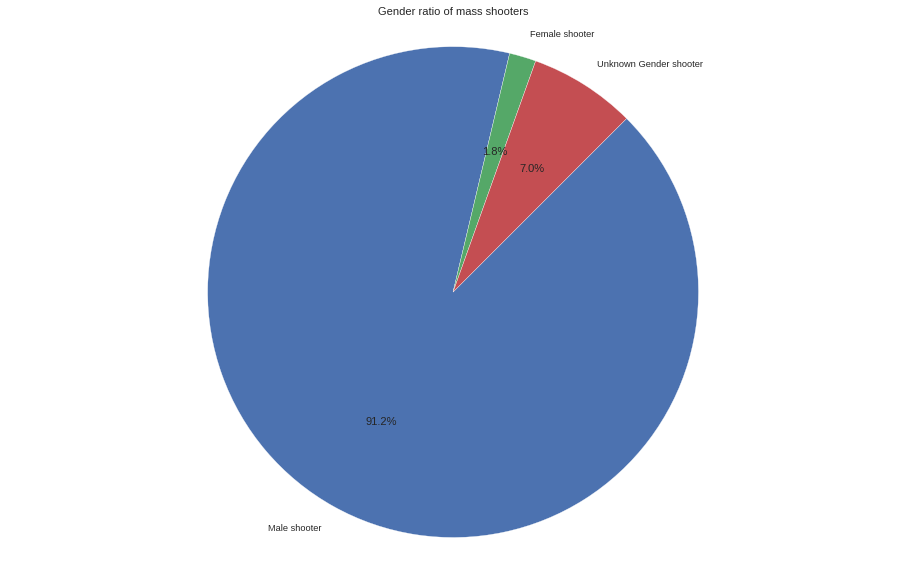
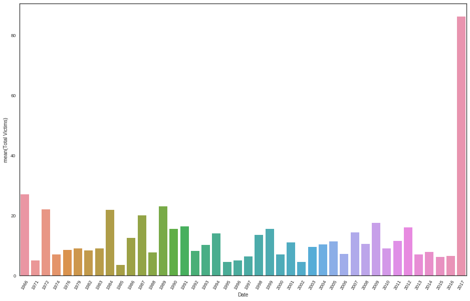

# Mass Shooting Project

## **Our Question**

Our data science question is: how has the rate of mass shootings in the US changed over the last 50 years?


Our hypothesis is that the rate of mass shootings has not significantly changed over the last 50 years.
The reason why we came to this hypothesis was because we felt that modern forms of communication and media made it much easier to hear about school shootings across the U.S immediately from anywhere, compared to the past, even if the rates of school shootings were the same.

## **Background**

The background and context of the problem we are addressing is that in modern-society, mass shootings have been reported so often that they are often no longer displayed as shocking, or headline news. As such, even after Sandy Hook’s mass shooting, there still has been a slew of mass shootings taking place in the United States, regardless of firearm restrictions and background checks. However, in spite of the horrific nature of mass shootings, there has been analysis done on various aspects of mass shootings, such as Vox’s analysis on the percentage of mass-shooting related deaths in the United States in 2016, with mass shootings only causing “456 of nearly 39,000 overall gun deaths” in the U.S (Lopez). Therefore, as a group, we became curious to see if the media portrayal of mass-shootings as an unfortunate part of life for Americans was due to social media networks allowing more and more news to be broadcast across the nation instantly. If it turns out that mass-shootings are really not that frequent, while any deaths from mass shootings should not be ignored, it could be useful for American society as a whole. This is because it could spark discussion about what is the majority of gun-related deaths, which are from suicides, and change the political discussion from polarizing gun control topics to addressing the mental health crisis in America. In fact, in comparison to mass-shootings, “22,000 Americans every year, including over 950 children and teens” commit firearm suicide (Every Town Research). In conclusion, we believe that by addressing the real frequency of mass-shootings that we can incite further discussion about the mental health crisis in American instead of polarizing people over gun-control laws.

### Works Cited

“Firearm Suicide in the United States.” EverytownResearch.org, 10 Sept. 2018, 

   everytownresearch.org/firearm-suicide/.

Lopez. “Mass Shootings since Sandy Hook, in One Map.” Vox.com, Vox, 9 July 2018, 

   www.vox.com/a/mass-shootings-america-sandy-hook-gun-violence.


## **Data Source**

Our dataset has 50 years worth of data for the mass shooting rate in the U.S. We found it on Kaggle here: https://www.kaggle.com/zusmani/us-mass-shootings-last-50-years. We downloaded the csv file from Kaggle and uploaded it to our drive folder to be viewed in Google Sheets here: https://docs.google.com/spreadsheets/d/1jUc_gdICNieuVvYKuNygpQedjNoZELWdxUlBDcPgEUs/edit?usp=sharing


According to Kaggle, the dataset has 398 observations. Each observation is a combination of the information in terms of the event and the criminal. Variables include location, fatality number, injured number,race of the criminal,gender, mental states, etc. 


We will create a new table and organize the dataset focusing on date and shooting rate. We will also study the variables to see if there is any connections between them.

## **Ethical Considerations**


### Data Collection
We did not directly collect the data since it was available publicly on Kaggle. We will limit PII by removing any data that reveals names of criminals. The data itself also did not include any names of victims by default, so that also limits PII exposure.
### Data Storage
The dataset will be stored in our Google Drive folder and everyone who has access to that folder will be able to work with it.
### Analysis
The data will not include any PII. Furthermore, we will be careful and aware when analyzing the relationship of shooters and gender, to avoid enforcing discriminatory interpretations of shooters. In addition, as mass shootings are a sensationalized topic by modern media today, we will make sure we that do not sensationalize the data as that would be ethically wrong to do, as the data values in our data set are not just numbers, but representations of people whose lives were forever changed or taken tragically.
### Modeling
We will be looking at the variable "date" to answer our question. The data we are working on now has no bias so far and we will use more data and use them together to make sure there will be no bias shows up. Furthermore, we can be fairly confident that our data has no bias, such information bias, selection bias, and confounders because we have cross-checked our data set with news reports to affirm each data point is legitimate. Additionally we can be confident that we do not have confounders in our dataset the victims/deaths are strictly by gun injury/death, along with no selection bias because we have a dataset of ALL the mass shootings in the U.S. in the last 50 years.
### Deployment
In case any users are harmed by the results, we will immediately any data points related to them upon their request. Furthermore, if there was a massive amount of data that was to be removed, we would find different variables to analyze to adjust for concept drift. Rollbacks in any case will be handled by the "Revision History" feature of Google Drive, as it is built-in already. On the topic of concept drift, if there is updated data from the original source on Kaggle regarding mass shooters, we will implement that new data into our assignment.

## **Importing Data**

We are using Google Drive instead of hostig our raw data files on GitHub.


```python
import pandas as pd 
#importing pandas as pd
from google.colab import drive
drive.mount('/content/drive')
%cd "/content/drive/My Drive/cogs_9_group_assignments"
#accessing directory with the dataset
df = pd.read_csv("mass_shootings_dataset.csv")
#reading the file into the Colab
df.head()
```

    Go to this URL in a browser: https://accounts.google.com/o/oauth2/auth?client_id=947318989803-6bn6qk8qdgf4n4g3pfee6491hc0brc4i.apps.googleusercontent.com&redirect_uri=urn%3Aietf%3Awg%3Aoauth%3A2.0%3Aoob&scope=email%20https%3A%2F%2Fwww.googleapis.com%2Fauth%2Fdocs.test%20https%3A%2F%2Fwww.googleapis.com%2Fauth%2Fdrive%20https%3A%2F%2Fwww.googleapis.com%2Fauth%2Fdrive.photos.readonly%20https%3A%2F%2Fwww.googleapis.com%2Fauth%2Fpeopleapi.readonly&response_type=code
    
    Enter your authorization code:
    ··········
    Mounted at /content/drive
    /content/drive/My Drive/cogs_9_group_assignments


<div>
<style scoped>
    .dataframe tbody tr th:only-of-type {
        vertical-align: middle;
    }

    .dataframe tbody tr th {
        vertical-align: top;
    }

    .dataframe thead th {
        text-align: right;
    }
</style>
<table border="1" class="dataframe">
  <thead>
    <tr style="text-align: right;">
      <th></th>
      <th>S#</th>
      <th>Title</th>
      <th>Location</th>
      <th>Date</th>
      <th>Summary</th>
      <th>Fatalities</th>
      <th>Injured</th>
      <th>Total victims</th>
      <th>Mental Health Issues</th>
      <th>Race</th>
      <th>Gender</th>
      <th>Latitude</th>
      <th>Longitude</th>
    </tr>
  </thead>
  <tbody>
    <tr>
      <th>0</th>
      <td>1</td>
      <td>Las Vegas Strip mass shooting</td>
      <td>Las Vegas, NV</td>
      <td>10/1/2017</td>
      <td>NaN</td>
      <td>58</td>
      <td>515</td>
      <td>573</td>
      <td>Unclear</td>
      <td>NaN</td>
      <td>NaN</td>
      <td>NaN</td>
      <td>NaN</td>
    </tr>
    <tr>
      <th>1</th>
      <td>2</td>
      <td>San Francisco UPS shooting</td>
      <td>San Francisco, CA</td>
      <td>6/14/2017</td>
      <td>Jimmy Lam, 38, fatally shot three coworkers an...</td>
      <td>3</td>
      <td>2</td>
      <td>5</td>
      <td>Yes</td>
      <td>Asian</td>
      <td>M</td>
      <td>NaN</td>
      <td>NaN</td>
    </tr>
    <tr>
      <th>2</th>
      <td>3</td>
      <td>Pennsylvania supermarket shooting</td>
      <td>Tunkhannock, PA</td>
      <td>6/7/2017</td>
      <td>Randy Stair, a 24-year-old worker at Weis groc...</td>
      <td>3</td>
      <td>0</td>
      <td>3</td>
      <td>Unclear</td>
      <td>White</td>
      <td>M</td>
      <td>NaN</td>
      <td>NaN</td>
    </tr>
    <tr>
      <th>3</th>
      <td>4</td>
      <td>Florida awning manufacturer shooting</td>
      <td>Orlando, Florida</td>
      <td>6/5/2017</td>
      <td>John Robert Neumann, Jr., 45, a former employe...</td>
      <td>5</td>
      <td>0</td>
      <td>5</td>
      <td>Unclear</td>
      <td>NaN</td>
      <td>M</td>
      <td>NaN</td>
      <td>NaN</td>
    </tr>
    <tr>
      <th>4</th>
      <td>5</td>
      <td>Rural Ohio nursing home shooting</td>
      <td>Kirkersville, Ohio</td>
      <td>5/12/2017</td>
      <td>Thomas Hartless, 43, shot and killed a former ...</td>
      <td>3</td>
      <td>0</td>
      <td>3</td>
      <td>Yes</td>
      <td>White</td>
      <td>M</td>
      <td>NaN</td>
      <td>NaN</td>
    </tr>
  </tbody>
</table>
</div>


## **Data Wrangling**

We dropped unnecessary columns and created a new clean dataframe to make it more convienient to read. The columns we deleted do not have any contribution to our analysis of the data. We also decided replaced M/F/blank with Male/Female/Unknown to make it easier to read and work with. We renamed the columns: S# and Total victims to make it more readable to the viewer. We manipulated the 'Date' column from M-D-Y to get just the Year in order to help with further analysis of the data. 


```python
# drop unnecessary columns and create new clean dataframe
tidy_df = df.drop(['Title','Location','Summary','Mental Health Issues','Race','Latitude','Longitude'], axis=1)  


# replace values with corresponding name
replaced_values = tidy_df.replace(["M", None, "M/F", "Male/Female"],["Male","Unknown","Unknown","Unknown"])

# renaming 2 column names
replaced_values = replaced_values.rename(index = str, columns = {"S#":"Shooting Number","Total victims":"Total Victims"})

# the function change_date will only get the year from the date, splicing the string
def change_date(string):
  return string[-4:]

# The date is replaced with the year
changed_date = replaced_values['Date'].apply(change_date)
replaced_values['Date'] = changed_date
replaced_values
```


<div>
<style scoped>
    .dataframe tbody tr th:only-of-type {
        vertical-align: middle;
    }

    .dataframe tbody tr th {
        vertical-align: top;
    }

    .dataframe thead th {
        text-align: right;
    }
</style>
<table border="1" class="dataframe">
  <thead>
    <tr style="text-align: right;">
      <th></th>
      <th>Shooting Number</th>
      <th>Date</th>
      <th>Fatalities</th>
      <th>Injured</th>
      <th>Total Victims</th>
      <th>Gender</th>
    </tr>
  </thead>
  <tbody>
    <tr>
      <th>0</th>
      <td>1</td>
      <td>2017</td>
      <td>58</td>
      <td>515</td>
      <td>573</td>
      <td>Unknown</td>
    </tr>
    <tr>
      <th>1</th>
      <td>2</td>
      <td>2017</td>
      <td>3</td>
      <td>2</td>
      <td>5</td>
      <td>Male</td>
    </tr>
    <tr>
      <th>2</th>
      <td>3</td>
      <td>2017</td>
      <td>3</td>
      <td>0</td>
      <td>3</td>
      <td>Male</td>
    </tr>
    <tr>
      <th>3</th>
      <td>4</td>
      <td>2017</td>
      <td>5</td>
      <td>0</td>
      <td>5</td>
      <td>Male</td>
    </tr>
    <tr>
      <th>4</th>
      <td>5</td>
      <td>2017</td>
      <td>3</td>
      <td>0</td>
      <td>3</td>
      <td>Male</td>
    </tr>
    <tr>
      <th>5</th>
      <td>6</td>
      <td>2017</td>
      <td>3</td>
      <td>0</td>
      <td>3</td>
      <td>Male</td>
    </tr>
    <tr>
      <th>6</th>
      <td>7</td>
      <td>2017</td>
      <td>5</td>
      <td>6</td>
      <td>11</td>
      <td>Male</td>
    </tr>
    <tr>
      <th>7</th>
      <td>8</td>
      <td>2016</td>
      <td>5</td>
      <td>0</td>
      <td>5</td>
      <td>Male</td>
    </tr>
    <tr>
      <th>8</th>
      <td>9</td>
      <td>2016</td>
      <td>3</td>
      <td>3</td>
      <td>6</td>
      <td>Male</td>
    </tr>
    <tr>
      <th>9</th>
      <td>10</td>
      <td>2016</td>
      <td>5</td>
      <td>11</td>
      <td>16</td>
      <td>Male</td>
    </tr>
    <tr>
      <th>10</th>
      <td>11</td>
      <td>2016</td>
      <td>49</td>
      <td>53</td>
      <td>102</td>
      <td>Male</td>
    </tr>
    <tr>
      <th>11</th>
      <td>12</td>
      <td>2016</td>
      <td>0</td>
      <td>4</td>
      <td>4</td>
      <td>Unknown</td>
    </tr>
    <tr>
      <th>12</th>
      <td>13</td>
      <td>2016</td>
      <td>1</td>
      <td>4</td>
      <td>5</td>
      <td>Unknown</td>
    </tr>
    <tr>
      <th>13</th>
      <td>14</td>
      <td>2016</td>
      <td>0</td>
      <td>6</td>
      <td>6</td>
      <td>Male</td>
    </tr>
    <tr>
      <th>14</th>
      <td>15</td>
      <td>2016</td>
      <td>0</td>
      <td>4</td>
      <td>4</td>
      <td>Male</td>
    </tr>
    <tr>
      <th>15</th>
      <td>16</td>
      <td>2016</td>
      <td>1</td>
      <td>4</td>
      <td>5</td>
      <td>Unknown</td>
    </tr>
    <tr>
      <th>16</th>
      <td>17</td>
      <td>2016</td>
      <td>4</td>
      <td>0</td>
      <td>4</td>
      <td>Male</td>
    </tr>
    <tr>
      <th>17</th>
      <td>18</td>
      <td>2016</td>
      <td>1</td>
      <td>4</td>
      <td>4</td>
      <td>Male</td>
    </tr>
    <tr>
      <th>18</th>
      <td>19</td>
      <td>2016</td>
      <td>0</td>
      <td>3</td>
      <td>4</td>
      <td>Unknown</td>
    </tr>
    <tr>
      <th>19</th>
      <td>20</td>
      <td>2016</td>
      <td>0</td>
      <td>4</td>
      <td>4</td>
      <td>Male</td>
    </tr>
    <tr>
      <th>20</th>
      <td>21</td>
      <td>2016</td>
      <td>0</td>
      <td>4</td>
      <td>4</td>
      <td>Unknown</td>
    </tr>
    <tr>
      <th>21</th>
      <td>22</td>
      <td>2016</td>
      <td>0</td>
      <td>5</td>
      <td>5</td>
      <td>Unknown</td>
    </tr>
    <tr>
      <th>22</th>
      <td>23</td>
      <td>2016</td>
      <td>3</td>
      <td>1</td>
      <td>3</td>
      <td>Male</td>
    </tr>
    <tr>
      <th>23</th>
      <td>24</td>
      <td>2016</td>
      <td>2</td>
      <td>2</td>
      <td>3</td>
      <td>Male</td>
    </tr>
    <tr>
      <th>24</th>
      <td>25</td>
      <td>2016</td>
      <td>3</td>
      <td>0</td>
      <td>3</td>
      <td>Male</td>
    </tr>
    <tr>
      <th>25</th>
      <td>26</td>
      <td>2016</td>
      <td>2</td>
      <td>2</td>
      <td>3</td>
      <td>Male</td>
    </tr>
    <tr>
      <th>26</th>
      <td>27</td>
      <td>2016</td>
      <td>2</td>
      <td>2</td>
      <td>3</td>
      <td>Male</td>
    </tr>
    <tr>
      <th>27</th>
      <td>28</td>
      <td>2016</td>
      <td>4</td>
      <td>0</td>
      <td>3</td>
      <td>Male</td>
    </tr>
    <tr>
      <th>28</th>
      <td>29</td>
      <td>2016</td>
      <td>4</td>
      <td>0</td>
      <td>3</td>
      <td>Male</td>
    </tr>
    <tr>
      <th>29</th>
      <td>30</td>
      <td>2016</td>
      <td>4</td>
      <td>0</td>
      <td>3</td>
      <td>Male</td>
    </tr>
    <tr>
      <th>...</th>
      <td>...</td>
      <td>...</td>
      <td>...</td>
      <td>...</td>
      <td>...</td>
      <td>...</td>
    </tr>
    <tr>
      <th>368</th>
      <td>369</td>
      <td>1988</td>
      <td>7</td>
      <td>4</td>
      <td>11</td>
      <td>Male</td>
    </tr>
    <tr>
      <th>369</th>
      <td>370</td>
      <td>1988</td>
      <td>1</td>
      <td>2</td>
      <td>3</td>
      <td>Male</td>
    </tr>
    <tr>
      <th>370</th>
      <td>371</td>
      <td>1987</td>
      <td>6</td>
      <td>14</td>
      <td>20</td>
      <td>Male</td>
    </tr>
    <tr>
      <th>371</th>
      <td>372</td>
      <td>1987</td>
      <td>6</td>
      <td>14</td>
      <td>20</td>
      <td>Male</td>
    </tr>
    <tr>
      <th>372</th>
      <td>373</td>
      <td>1986</td>
      <td>1</td>
      <td>3</td>
      <td>4</td>
      <td>Male</td>
    </tr>
    <tr>
      <th>373</th>
      <td>374</td>
      <td>1986</td>
      <td>15</td>
      <td>6</td>
      <td>21</td>
      <td>Male</td>
    </tr>
    <tr>
      <th>374</th>
      <td>375</td>
      <td>1986</td>
      <td>15</td>
      <td>6</td>
      <td>20</td>
      <td>Male</td>
    </tr>
    <tr>
      <th>375</th>
      <td>376</td>
      <td>1986</td>
      <td>1</td>
      <td>4</td>
      <td>5</td>
      <td>Male</td>
    </tr>
    <tr>
      <th>376</th>
      <td>377</td>
      <td>1985</td>
      <td>2</td>
      <td>1</td>
      <td>3</td>
      <td>Male</td>
    </tr>
    <tr>
      <th>377</th>
      <td>378</td>
      <td>1985</td>
      <td>1</td>
      <td>3</td>
      <td>4</td>
      <td>Male</td>
    </tr>
    <tr>
      <th>378</th>
      <td>379</td>
      <td>1984</td>
      <td>22</td>
      <td>19</td>
      <td>41</td>
      <td>Male</td>
    </tr>
    <tr>
      <th>379</th>
      <td>380</td>
      <td>1984</td>
      <td>22</td>
      <td>19</td>
      <td>40</td>
      <td>Male</td>
    </tr>
    <tr>
      <th>380</th>
      <td>381</td>
      <td>1984</td>
      <td>6</td>
      <td>1</td>
      <td>7</td>
      <td>Male</td>
    </tr>
    <tr>
      <th>381</th>
      <td>382</td>
      <td>1984</td>
      <td>6</td>
      <td>1</td>
      <td>7</td>
      <td>Male</td>
    </tr>
    <tr>
      <th>382</th>
      <td>383</td>
      <td>1984</td>
      <td>3</td>
      <td>12</td>
      <td>14</td>
      <td>Male</td>
    </tr>
    <tr>
      <th>383</th>
      <td>384</td>
      <td>1983</td>
      <td>1</td>
      <td>3</td>
      <td>4</td>
      <td>Male</td>
    </tr>
    <tr>
      <th>384</th>
      <td>385</td>
      <td>1983</td>
      <td>13</td>
      <td>1</td>
      <td>14</td>
      <td>Male</td>
    </tr>
    <tr>
      <th>385</th>
      <td>386</td>
      <td>1982</td>
      <td>8</td>
      <td>3</td>
      <td>11</td>
      <td>Male</td>
    </tr>
    <tr>
      <th>386</th>
      <td>387</td>
      <td>1982</td>
      <td>9</td>
      <td>3</td>
      <td>11</td>
      <td>Male</td>
    </tr>
    <tr>
      <th>387</th>
      <td>388</td>
      <td>1982</td>
      <td>1</td>
      <td>2</td>
      <td>3</td>
      <td>Male</td>
    </tr>
    <tr>
      <th>388</th>
      <td>389</td>
      <td>1979</td>
      <td>2</td>
      <td>5</td>
      <td>7</td>
      <td>Male</td>
    </tr>
    <tr>
      <th>389</th>
      <td>390</td>
      <td>1979</td>
      <td>2</td>
      <td>9</td>
      <td>11</td>
      <td>Female</td>
    </tr>
    <tr>
      <th>390</th>
      <td>391</td>
      <td>1976</td>
      <td>7</td>
      <td>2</td>
      <td>9</td>
      <td>Male</td>
    </tr>
    <tr>
      <th>391</th>
      <td>392</td>
      <td>1976</td>
      <td>1</td>
      <td>7</td>
      <td>8</td>
      <td>Male</td>
    </tr>
    <tr>
      <th>392</th>
      <td>393</td>
      <td>1974</td>
      <td>3</td>
      <td>7</td>
      <td>10</td>
      <td>Male</td>
    </tr>
    <tr>
      <th>393</th>
      <td>394</td>
      <td>1974</td>
      <td>1</td>
      <td>3</td>
      <td>4</td>
      <td>Male</td>
    </tr>
    <tr>
      <th>394</th>
      <td>395</td>
      <td>1972</td>
      <td>10</td>
      <td>13</td>
      <td>22</td>
      <td>Male</td>
    </tr>
    <tr>
      <th>395</th>
      <td>396</td>
      <td>1971</td>
      <td>2</td>
      <td>4</td>
      <td>5</td>
      <td>Male</td>
    </tr>
    <tr>
      <th>396</th>
      <td>397</td>
      <td>1966</td>
      <td>5</td>
      <td>1</td>
      <td>6</td>
      <td>Male</td>
    </tr>
    <tr>
      <th>397</th>
      <td>398</td>
      <td>1966</td>
      <td>17</td>
      <td>32</td>
      <td>48</td>
      <td>Male</td>
    </tr>
  </tbody>
</table>
<p>398 rows × 6 columns</p>
</div>


## **Exploratory Data Analysis**


```python
import seaborn as sns
import pandas as pd
sns.set(font_scale=0.925)
import matplotlib as mpl
import matplotlib.pyplot as plt
import matplotlib.style as style
plt.rcParams['figure.figsize']=(16,10)
import numpy as np
import warnings
warnings.filterwarnings('ignore')
shootingset=replaced_values

sns.set_style("white")
sns.countplot(x='Date', data=shootingset)
```


    <matplotlib.axes._subplots.AxesSubplot at 0x7f7d99073cc0>





Above, we can see that there has been an overall increase in the number of mass shootings per year in the last six years. Furthermore, we can see that there the peaks of mass shootings from 1999 onward appear to have 7 year gaps approximately.


```python
  unknown=replaced_values.loc[replaced_values['Gender'] == 'Unknown'].shape[0]/replaced_values.shape[0]*100
male=replaced_values.loc[replaced_values['Gender'] == 'Male'].shape[0]/replaced_values.shape[0]*100
female=replaced_values.loc[replaced_values['Gender'] == 'Female'].shape[0]/replaced_values.shape[0]*100

fig,ax=plt.subplots()
shooting={"Male shooter":male,"Female shooter":female,"Unknown Gender shooter":unknown}
data=np.array([i for i in shooting.values()]).astype(float)
label=np.array([j for j in shooting.keys()])
ax.pie(data,labels=label,autopct='%.1f%%',startangle=45,counterclock=False,wedgeprops=dict
(width=1,edgecolor='w'))
ax.set_title("Gender ratio of mass shooters")
ax.axis("equal")
plt.show()
```





Above, we can see that an overwhelming majority of mass shooters are male shooters.


```python
a=sns.barplot (x='Date',y='Total Victims',data=shootingset,ci=False)
for Date in a.get_xticklabels():
    Date.set_rotation(60)
    plt.rcParams['figure.figsize']=(15, 8)
```





Above, we can see that the average total victims from mass shootings each year is around the same, except for 2017 being a massive outlier. This is quite interesting as earlier we saw a different trend when looking at the number of mass shootings per year, which indicates that a higher frequency of shootings per year does not necessarily indicate a higher average of victims from shootings per year.

## **Analysis Proposal**

Though we showed some graphs above to display our results, we want to conduct descriptive analysis. We plan on doing this by comparing the rate of mass shootings in the last 10 years compared to the last 50 years across groups. 

*avg_mass_shootings_10 =  mass_shootings_10_count / 10*

*avg_mass_shootings_50 = mass_shootings_50_count / 50*

From this point, we would conduct a t-test to interpret the averages of the groups of mass-shootings, as discussed in our math lecture, by using the hypotheses below.

*Ho = avg_mass_shootings_10 - avg_mass_shootings_50 = 0*

*Ha = avg_mass_shootings_10 - avg_mass_shootings_50 ≠ 0*

(alpha level will be set to 0.05)

From now we don’t know if the two groups have different variances, or have normal distributions (among other t-test assumptions), so we’ll be checking on that before interpreting.

Regardings biases, the data being analyzed is devoid of variables to include a shooters gender, to avoid gender biases and stereotypes of mass shooters. Other limitations to our analysis is that we are not analyzing the fatalities or injured variables whatsoever to achieve the answer to our data science question, even though they are just as intriguing.


## **Summary**
In this project, we intended to answer the question of whether the mass shooting rate in the U.S. has changed over the past fifty years.To determine it, we extracted a dataset with 398 recorded mass shooting cases from Kaggle and modified it to a more readable form. We visualized the number of cases in different years, the average of victims in different years, and compared the proportion of mass shooters of different genders. During our exploratory analysis, we found out that the average of victims each year did not necessarily correspond to the somehow higher frequency of mass shootings each year.  

To statistically answer this question, we would conduct a t-test to compare the rate of mass shootings in the last 10 years versus the last 50 years. Based on our hypothesis, we would expect to see that the difference of the means of both time periods was equal to zero. If this were true, we would know that the null hypothesis should not be rejected, which would confirm our initial hypothesis that the rate has not changed from the past fifty years to just the past ten years.

However, there are some limitations in our analysis. First, we have too many years of data of mass shooting to analyze in our dataset. Our dataset shows the mass shooting from 1966 to 2017, which make up our table and graphs. In order to show the change of number of mass shootings over year, we have to keep those data. Second, we deleted the non-numerical part of our original dataset, because it was categorical and we wanted quantitative data, which left us less data to analyze. 

The implications of our analysis in either case, confirming our hypothesis or not, would be on how informed those in society, and especially those in office, are about the rate of shootings within the country. How the government reacts in terms of gun control and restrictions could be affected. If the rate of shootings has changed, those in office may seek to limit access to guns within society, or implicate laws which make ownership more difficult. If not, those in support of gun rights may use the findings to support the continued access to guns within the country. 


## **Contributions**
When our group first met up we spent around a good 3 hours all working on the question we wanted to answer as well as which dataset was right to answer the question we agreed on. We then proceeded to split up the work for assignment 1, Yi was in charge of the data section where she explained what our data included and what variables we were going to look at. The ethical considerations was split up between Jasmine, Mengyu, Issac, and Ronaldo. The second time our group met, we worked on assignment 2, where we had to do some data wrangling. For the most part, Mengyu and Ronaldo were the ones in charge of the code done to clean up the data and put it into a form that was readable and easy to understand. For the 3rd assignment, we had to do some exploratory data analysis. For this part, Yi and Jasmine were the ones who coded various different graphs which they pulled from the data. Mengyu and Ronaldo looked at the various graphs Yi and Jasmine produced and took the 3 best ones that best explained our data and helped answer our question. Issac wrote down what each graph explains about our data and how it helps answer our question, he also went back to past sections of the assignment to incorporate the TAs comments on our past assignments.


---


   For the 4th assignment, we had to propose how we would analyze the data we had in order to come to a conclusion. This was mostly done by Issac and Yi. They decided on comparing the rates of shootings from the past 10 years versus the last 50 years and conducting a t-test to interpret the averages of the groups of mass-shootings. For the final assignment, Yi, Jasmine, and Mengyu all split up the work for the summary part of it, Issac was in charge of typing up the background and Ronaldo was in charge of writing up the contributions of each of the group members.

